# Hey👋! I’m Anurag

 

  
Software Engineer · 5+ years of experience · MSCS @ Northeastern (Khoury College), Boston, MA.

  
<i>Full-stack · Cloud · Gen AI · Distributed systems</i>

  
Building systems that ship — and I care about the path from a concept to reality. Driven by curiosity, scale, and work with real-world impact.

  Open to connecting, Cheers!🌟

## 🚀 Currently Contributing

🦞 [OpenClaw.ai](https://openclaw.ai)  — Shipped a 🔐 security fix to  production release [v2026.5.3](https://github.com/openclaw/openclaw/releases/tag/v2026.5.3) · ([PR #76693](https://github.com/openclaw/openclaw/pull/76693))

## 🌐 My Socials

  

## 💻 Tech Stack

                                   

## 📊 Contribution Metrics

<!-- 

  

 -->
<!-- 

  

 -->

<!-- Proudly created with GPRM ( https://gprm.itsvg.in ) -->
